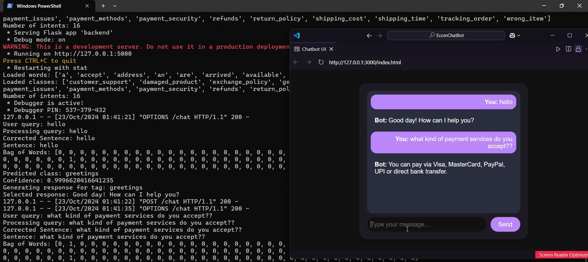

# EcomChatBot

An intelligent e-commerce chatbot built with Natural Language Processing (NLP) techniques, integrated within a Flask API. This chatbot leverages deep learning and various NLP libraries to provide natural, context-aware customer interactions.


[](https://www.python.org/)
[](https://tensorflow.org/)

[EcomChatBot Demo (Video)](https://raw.githubusercontent.com/nayaksomkar/EcomChatBot/main/EcomChatBot.mov)



## Features

- **Multilingual Support**: Handles customer queries in multiple languages using Google Translate integration
- **Intelligent Spell Correction**: Automatically fixes typos and spelling mistakes using the `autocorrect` library
- **Advanced Intent Classification**: Uses deep learning to accurately identify customer intents
- **Context-Aware Conversations**: Maintains conversation context for more natural interactions
- **Neural Network Backend**: Powered by Keras with TensorFlow for robust intent classification

## Prerequisites

- Python 3.7+
- pip package manager

## Installation

1. Clone the repository:
   ```bash
   git clone https://github.com/nayaksomkar/EcomChatBot
   cd EcomChatBot
   ```

2. Create a virtual environment (optional but recommended):
   ```bash
   # Windows
   python -m venv venv
   venv\Scripts\activate

   # Linux/Mac
   python3 -m venv venv
   source venv/bin/activate
   ```

3. Install dependencies:
   ```bash
   pip install -r requirements.txt
   ```

## Setup and Running

### Step 1: Train the Model (if not already trained)

Run the training script to generate the model and required data files:

```bash
python responseEngine.py
```

This will:
- Process the intent data from `response.json`
- Generate `words.pkl` and `classes.pkl` files
- Train the neural network model
- Save the trained model as `responseEngine.h5`

### Step 2: Start the Backend Server

```bash
python backend.py
```

The backend server will start on `http://127.0.0.1:5000`.

### Step 3: Launch the Frontend

Open `index.html` in a web browser. The chatbot interface will connect to the backend server.

Alternatively, you can serve the frontend using Python:

```bash
# Windows
python -m http.server 8000

# Linux/Mac
python3 -m http.server 8000
```

Then open `http://localhost:8000` in your browser.

## Project Structure

```
EcomChatBot/
├── index.html           # Frontend HTML
├── styles.css           # Styling
├── script.js            # Frontend JavaScript
├── backend.py           # Flask backend server
├── responseEngine.py    # Model training script
├── responsefunction.py  # NLP processing utilities
├── response.json        # Intent data
├── requirements.txt     # Python dependencies
├── words.pkl            # Generated vocabulary
├── classes.pkl          # Generated intent classes
├── responseEngine.h5    # Trained model
└── README.md            # This file
```

## Model Training

The chatbot uses a neural network model for intent classification. To train on custom data:

1. Update `response.json` with your custom intents and responses
2. Run `python responseEngine.py` to generate a new model
3. The new model will be saved as `responseEngine.h5`

## API Endpoints

| Endpoint | Method | Description |
|----------|--------|-------------|
| `/chat`  | POST   | Send a message and get a response |

### Request Format
```json
{
    "message": "Hello"
}
```

### Response Format
```json
{
    "response": "Hello! How can I assist you today?"
}
```

## Technologies Used

- **TensorFlow/Keras** - Deep learning for intent classification
- **NLTK** - Natural Language Toolkit for text processing
- **Flask** - Web framework for API
- **Google Translate** - Multilingual support
- **Autocorrect** - Spell correction